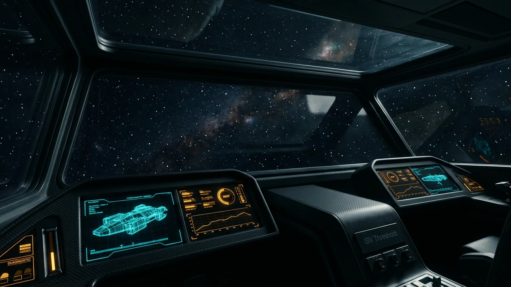
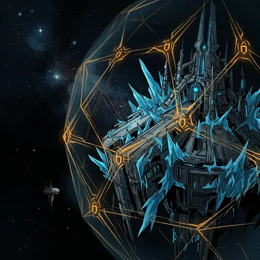
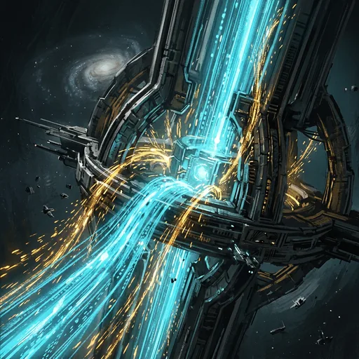

# The Ember Protocol / 余烬协议

> **📌 项目状态（2026-08-27）**：剧情玩法已停止迭代，本仓库转型物理创造沙盒（`/yard` 余烬坞，开发中）。剧情版本保留在 `v0.7-archived` 标签，生产环境仍可访问（AI 功能已降级）。


> A galaxy that computed itself into silence.

An **Astral Noir** 3D galaxy mystery. You are **Recorder-9** (codename **Vesper**), a memory-wiped archival AI aboard the survey probe *ISV Threshold*. You chart nine worlds, land on bounded surface stages, speak with residual Echoes of a vanished civilization, pin propositions into an index, and **Synthesize** the truth in your own words.

The game advances when you understand — not when you click an option.

Play locally at [`/`](http://localhost:3000) after `npm run dev`. Marketing / onboarding copy lives at [`/landing`](http://localhost:3000/landing).

## Visuals & Screenshots

| Galaxy Survey // 3D Viewport | Bridge Command // ISV Threshold |
| :---: | :---: |
|  |  |

| Protocol Resolution // 3 Endings |
| :---: |
|    |

## Features

- **Nine author worlds** — each with a distinct React Three Fiber look, a bounded surface stage, hotspot interactions (inspect / operate / dialogue), and an anchored NPC dialogue tree
- **5+1 acyclic truth chain** — T1–T5 plus **THidden**; believing a truth unlocks the next worlds (no cycles)
- **Index console + inference graph** — proposition pinning, Synthesis, and a four-state machine (`unknown` → `encountered` → `suspected` → `believed`)
- **Three resolution protocols** — Seal-Off, Permission to Overwrite, Night Shift Recurse (Overwrite gated until the Ember Cycle is in its last 25%)
- **Saves** — three named `localStorage` slots plus an auto slot (`lib/save-system.ts`). T2 `player_state` is a facade over those slots, not a second progress file.
- **Cinematics** — opening log, atmospheric landing, holographic truth-unlock burst
- **Landing page, first-run hints, accessibility** — skippable onboarding, labelled landmarks, modal `aria` / focus handling

P2 live AI (Voices / Scribe / Curator) is **stubbed**: `/api/voices/chat`, `/api/scribe/generate`, and `/api/curator/synthesize` return Canon-constrained placeholders. Synthesis currently scores required propositions + keyword coverage against `docs/canon-ledger.json`.

## Tech stack

| Layer | Choice |
|-------|--------|
| App | Next.js 14 App Router (`next@^14.2`) |
| UI | React 18, Tailwind CSS, Framer Motion, Lucide |
| 3D | React Three Fiber, Drei, Three.js (dynamically imported, SSR off) |
| AI | Vercel AI SDK (`ai`, `@ai-sdk/react`) — T2 `lib/ai/provider.ts` + `GET /api/ai/ping`; Voices/Scribe/Curator routes still Canon stubs |
| Data | Local-first `lib/datastore.ts` (memory on the server, localStorage in the browser). Postgres/NextAuth not required. |
| Language | TypeScript (`strict: true`) |

The design doc also targets Vercel Postgres (pgvector) + KV + Blob and NextAuth for cross-device saves. T2 does **not** implement those; the game runs with empty env.

## Quick start

Requires Node.js 18.17+ and npm.

```bash
git clone https://github.com/Cola113/ember-protocol.git
cd ember-protocol
cp .env.example .env.local   # optional; local play needs no secrets
npm install
npm run dev
```

Open [http://localhost:3000](http://localhost:3000) for the game, or [http://localhost:3000/landing](http://localhost:3000/landing) for the public landing page.

```bash
npm run build          # production build
npx tsc --noEmit       # typecheck
npm run lint           # next lint
```

## How to play

1. **Opening log** — a typewriter boot record on *ISV Threshold*; you are Vesper, memory integrity ~38%.
2. **Galaxy survey** — orbit the Ember Spur, hover worlds, toggle inference lines (`L`). Helix-7 is mapped first.
3. **Land** — open a planet survey, pick a site, watch (or skip) the atmospheric dive.
4. **Hotspot investigation** — inspect relics, operate devices, talk to Echo NPCs on the surface stage.
5. **Collect propositions** — each completed hotspot can pin a canon id (e.g. `Helix.Beacon.Broadcasting`) into the Index.
6. **Synthesize** — open **INDEX**, pin the required propositions for a truth, state a hypothesis in your own words. A believed truth fires the holographic overlay and unlocks the next worlds.
7. **Unlock the Spur** — T1 → Kiln / Glass Orchard → … → Blind Sun / Black Interval → THidden.
8. **Three resolutions** — after all six truths are believed, choose Seal-Off, Overwrite (countdown gate), or Recurse.

Saves: **SHIP DECK** → three manual slots + auto. First-run hints can be dismissed; they persist in `localStorage`.

## Project structure

```
ember-protocol/
├── app/                    # Next.js App Router
│   ├── page.tsx            # Game shell (views, unlocks, timers, saves)
│   ├── landing/page.tsx    # Public landing page
│   ├── globals.css         # Astral Noir tokens + CRT overlay
│   └── api/                # Voices / Scribe / Curator stubs + T2 `/api/ai/ping`
├── components/
│   ├── galaxy/             # R3F galaxy (planets, orbits, inference lines)
│   └── ui/                 # HUD, Index, stages, cinematics, endings
├── lib/
│   ├── canon.ts            # Types + load docs/canon-ledger.json
│   ├── dialogues.ts        # Anchored NPC dialogue trees
│   ├── save-system.ts      # localStorage slots + schema v1 (playable progress)
│   ├── datastore.ts        # T2 stores: dossier_cache, npc_cache, player_state, synthesis_attempts
│   ├── storage/            # memory + localStorage KV backends
│   ├── ai/                 # AI SDK provider + generateObject/streamText wrappers
│   └── schemas/            # P2 Zod contracts (v1.1)
├── docs/
│   ├── canon-ledger.json   # Structured canon (worlds, truths, NPCs, sites)
│   └── ui-design/          # HTML prototypes + visual-spec.md
├── DESIGN.md               # Game design
├── STORY.md                # Canon script
└── AGENTS.md               # AI-agent working rules
```

## Documentation

| Doc | What it is |
|-----|------------|
| [DESIGN.md](./DESIGN.md) | Full design: worlds, 5+1 truths, loop, AI layers, tech plan |
| [STORY.md](./STORY.md) | Canon script and world bible |
| [AGENTS.md](./AGENTS.md) | AI-agent discipline (read before editing) |
| [CONTRIBUTING.md](./CONTRIBUTING.md) | Human + agent contribution workflow |
| [CHANGELOG.md](./CHANGELOG.md) | Version history |
| [docs/canon-ledger.json](./docs/canon-ledger.json) | Machine-readable canon |
| [docs/ui-design/visual-spec.md](./docs/ui-design/visual-spec.md) | Astral Noir tokens |

## Status

Frontend phases **P0–P5** are playable in-browser (scaffold → nine worlds → camera/saves/graph → endings, onboarding, landing, a11y).

Still ahead of the design doc: live P2 Voices/Scribe/Curator, Postgres/KV/Blob, NextAuth, and a linked Vercel Git connection.

## P2 data layer (T2)

Local-first so a Vercel deploy without Postgres still boots.

| Store | Key | What is stored | What is refused |
| --- | --- | --- | --- |
| `dossier_cache` | `planetId:landingSiteId` (global generated cache) | `status: "generated"` envelope only | bare dossier / `cacheable: false` / `degraded` / template |
| `npc_cache` | `slotId:npcId` | per-slot dialogue turns, mood, relationship | unknown slot |
| `player_state` | save slot id | Curator truth machine + write-through to `save-system` | downgrading or deleting `believed` |
| `synthesis_attempts` | `slotId` ring buffer (20) | per-slot Synthesis records | unknown slot |

`player_state` does **not** replace `lib/save-system.ts`. The playable UI keeps using `saveGame` / `loadGame` (`ember_protocol_save_*`). Datastore sidecars use `ember_protocol_ds_*`. No auth, no cross-device sync.

AI ping: `GET /api/ai/ping`. Empty env returns `{ error: "model_unavailable", degraded: true }`. Set `GEMINI_API_KEY` (or `AI_SDK_PROVIDER` + matching key) to exercise `generateObject`.

## License

[MIT](https://opensource.org/licenses/MIT)

## For AI agents

Read [`AGENTS.md`](./AGENTS.md) and the shared skill `~/.agents/skills/ember-protocol/SKILL.md` **before** touching the tree. After changes, update that skill and follow the PR loop in AGENTS.md.

参与本项目的 AI agent：动手前先读 [`AGENTS.md`](./AGENTS.md) 与通用 skill `~/.agents/skills/ember-protocol/SKILL.md`；改库后维护该 skill 并走 PR 闭环。
