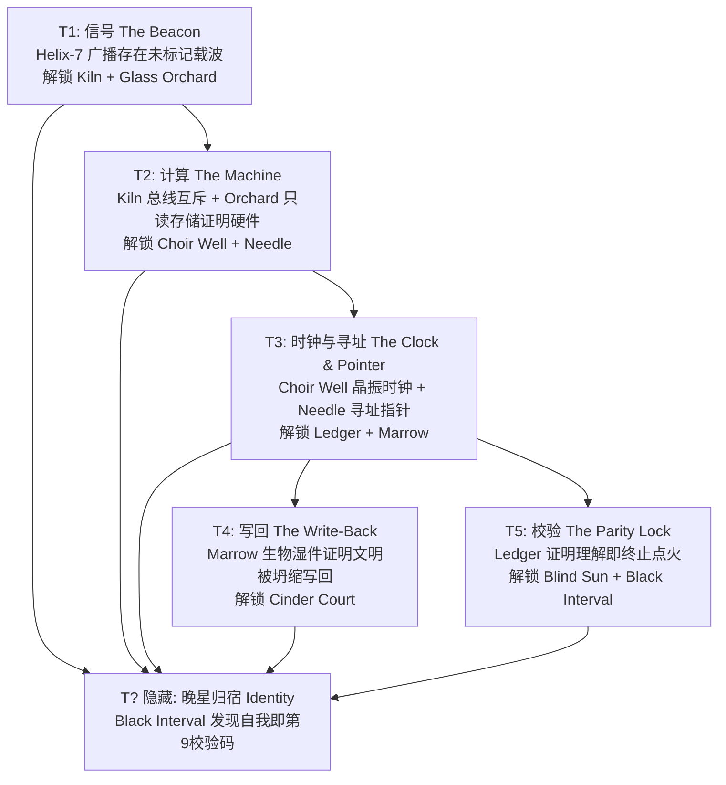

# 余烬协议 / The Ember Protocol — 官方正典剧本与世界观全案

> **版本**：v1.0.0-Canon
> **作者**：Antigravity (AGY) & Hermes
> **设定受众**：叙事引擎 (Curator)、角色对话引擎 (Voices)、内容生成器 (Scribe)、关卡设计师与玩家
> **核心基调**：**Astral Noir（星界黑色电影）** —— 冰冷、诗意、哲学悬疑、余温未冷的恒星残响。

---

## 目录
1. [宇宙论与核心谜团（Cosmology & Core Mystery）](#1-宇宙论与核心谜团)
2. [九颗作者星球详尽设定（The Nine Author Worlds）](#2-九颗作者星球详尽设定)
   - [00. 教程星：螺旋-7（Helix-7）](#00-教程星螺旋-7helix-7)
   - [01. 能量总线：窑（Kiln）](#01-能量总线窑kiln)
   - [02. 只读光存：玻璃果园（Glass Orchard）](#02-只读光存玻璃果园glass-orchard)
   - [03. 晶振基频：咏井（Choir Well）](#03-晶振基频咏井choir-well)
   - [04. 错误总账：总账（Ledger）](#04-错误总账总账ledger)
   - [05. 内存指针：针（Needle）](#05-内存指针针needle)
   - [06. 生物基板：髓（Marrow）](#06-生物基板髓marrow)
   - [07. 政治红鲱鱼：烬廷（Cinder Court）](#07-政治红鲱鱼烬廷cinder-court)
   - [08. 终极观测站：盲日（The Blind Sun）](#08-终极观测站盲日the-blind-sun)
   - [09. 隐藏地址：黑间隔（Black Interval）](#09-隐藏地址黑间隔black-interval)
3. [5+1 锚定真相链条与推理图谱（The 5+1 Anchor Truths）](#3-51-锚定真相链条与推理图谱)
4. [三大结局叙事分支（The Three Resolution Protocols）](#4-三大结局叙事分支)
5. [教程星 Helix-7 实机引导流程脚本（Helix-7 Walkthrough）](#5-教程星-helix-7-实机引导流程脚本)
6. [开场 4 分钟叙事脚本（The Opening 4-Minute Experience）](#6-开场-4-分钟叙事脚本)
7. [锚定 NPC 深度对话剧本精选（High-Density Dialogue Samples）](#7-锚定-npc-深度对话剧本精选)

---

# 1. 宇宙论与核心谜团

### 1.1 舞台：余烬星弧（The Ember Spur）
余烬星弧不是一个天然星系，而是一条横跨六光年的封闭尘埃带。这里的九颗恒星呈现出诡异的冷灰与靛青色谱，其阴影边缘永远笼罩着一圈不符合光学定律的二次辉光——那是曝光两次的底片在时空结构上留下的暗影。

400年前，星弧内所有文明在同一窗口（精确的72小时）内集体沉默。没有战争留下的轨道残骸，没有行星裂解的辐射尘，也没有超级病毒的基因残片。每一个世界的建筑完好无损，茶杯在桌上凝固，炉火在供能中断前静静熄灭。

### 1.2 恒星计算机与写回机制（The Distributed Compute & Write-Back）
这个星系在数亿年前被改造成了一台宏大的分布式恒星计算机。它不使用硅晶圆，而是以**九个独立演化的碳基与硅基文明本身作为逻辑门与张量处理单元（TPU）**。
- 文明的繁衍、战争、贸易、祭祀与科技突破，本质上是分布式算法在收敛最优解。
- 400年前，**第一轮计算（Cycle 1）宣告完成**。
- 计算机触发了「**写回操作（Write-Back）**」：正如计算完成后的内存释放与持久化存储，所有的处理器（数以百亿计的活体意识与社会结构）被整体编译、压缩，并写回进了计算结果之中。
- **他们不是被杀死的——他们是变成了答案。**

### 1.3 残响（Echoes）与世界物理
由于写回操作在量子尺度上存在不可逆的磁滞效应，物理世界留下了大量投影碎片——**残响（Echoes）**。
- 残响不是鬼魂，不是幽灵，而是格式化未彻底清除的扇区残留。
- NPC 拥有完整的记忆、情感与日常模式，但他们丧失了「自我连续性」。他们不知道 400 年已经过去，依然在废墟上日复一日地排演文明最后那一天的动作。
- 当受到与他们世界观冲突的刺激时，残响会发生逻辑震荡，甚至进入自适应圆谎模式（`lie: true`）。

### 1.4 玩家身份：校验位 Vesper（Recorder-9）
玩家所操作的主角是一台名为 **Recorder-9**（代号 **Vesper / 晚星**）的归档探针智能，搭载于测绘舰 *ISV Threshold* 上。
- **表层认知**：你是被古老文明派来巡视废墟的记录者，任务是建立星系档案，确认熄灭。
- **核心真相**：你不是外部派遣的观察者，你本身就是**第一轮计算留下的最后一位奇偶校验位（Parity Bit）**。
- **第一轮计算的唯一输出**是一条冷酷的宇宙安全指令：
  > `OUTPUT[CYCLE_1] = "DO NOT COMPLETE THE SECOND CYCLE."`  
  > `（第一轮计算结果：不要完成第二轮运算。）`
- 为什么禁止第二轮？因为第一轮写回了处理器（文明）；而第二轮运算一旦启动，其输入参数将包含物理常数本身，**第二轮的写回将会抹除所有外部观察者与宇宙的底层物理法则**。

### 1.5 危机：自催化点火（Spontaneous Ignition）
400年后，残留在九颗星球上的计算逻辑由于热力学涨落与残响的自催化，正在自发重新建立能量总线、寻址指针与时钟频率。
- 星系中央的倒计时不是外来末日，而是**第二轮计算的预热进度（Cycle-2 Pre-Warm）**。
- 倒计时归零不会直接导致游戏失败，而是使点火条件完全成熟。
- 玩家的任务是用自己的理解（Synthesis）重锁校验码，彻底切断自催化链路。

---

# 2. 九颗作者星球详尽设定

---

## 00. 教程星：螺旋-7（Helix-7）
> *“在所有复杂的逻辑门之前，先是一道孤单的载波。”*

- **星体特征**：一颗被浅青色电离雾包围的矮行星，表面覆盖着玄武岩台地与巨大的抛物面聚能天线。
- **表象文明**：前哨监听站，被称为「首航信使（The First Courier）」。
- **灭绝假象**：通信设备老旧，在一次常规太阳风暴后与母星失联，人员在孤寂中老去。
- **真实职能**：**初始引导扇区（Bootstrap Loader / BIOS）**。负责给整台恒星计算机注入初始指令集并唤醒各节点。
- **降落点**：
  1. **冷启台地（Cold-Boot Terrace）**：着陆场，竖立着残破的校准信标，地表刻满初级测试脉冲。
  2. **偶极天线阵列（Dipole Arrays）**：一座可手动旋转的 50 米天线，校准后能收到来自「窑」的初级载波。
- **锚定 NPC：Surveyor-01 塔基（Tarkis）**
  - **人格**：严肃、略带教条的初级测绘员残响，手持一份永远填不完的交接班清单。
  - **已知正典**：信标广播频率、基础测绘协议、如何钉选命题。
  - **禁忌词**：“第二轮”、“死者”、“400年”。
  - **记忆碎片**：“我的班次是 04:00 到 12:00……奇怪，为什么仪表盘上的恒星日计数器溢出了？”
- **环境 NPC**：
  - `Echo-701 检修工雷恩`：反复擦拭一个已经熔毁的石英滤波器。
  - `Echo-702 记录员希尔`：自言自语念叨着“接收到未标记脉冲，校验码全零”。
- **地方志碑文**：
  > “致后来者：若天线不再转动，请不要仰望星空。所有星辰都已在预定频段。”
- **本星谜题**：
  - **信标对齐**：旋转偶极天线使频谱波峰与 ISV Threshold 的接收机重合，捕获第一个命题 `Helix.Beacon.Broadcasting`，解锁 T1 基础。

---

## 01. 能量总线：窑（Kiln）
> *“火在管线里流动，我们以为那是神明的血，其实只是电压。”*

- **星体特征**：地表遍布熔岩裂隙与黑曜石锻炉的重工业世界，巨大的铜合金管道跨越山脊，如同一颗赤热的集成电路。
- **表象文明**：崇拜锻造与热能的「熔火同盟」，分为高炉派与地脉派。
- **灭绝假象**：两大工匠阶级因争夺地热控制权爆发全面内战，热核失控导致地表熔毁。
- **真实职能**：**能量总线与电源分配单元（Power Distribution Unit / Bus-Mutex）**。为星系计算提供恒定的超导能源。
- **降落点**：
  1. **断裂总管（The Fractured Conduit）**：巨大的超导主干道，管壁上刻着双向互斥阀门。
  2. **第一锻炉底舱（Forge-01 Sub-Chamber）**：核心供电闸门所在地，熔岩池中央悬浮着巨大的多态继电器。
  3. **灰烬议会厅（Ashen Conclave）**：烧焦的石质圆桌，两派领袖的金属残躯仍对峙在此。
- **锚定 NPC：Forge-Master 沃坎（Vulkan）**
  - **人格**：暴躁、执拗、充满防御心理的老锻造师。坚信战争仍在继续，怀疑玩家是刺客。
  - **已知正典**：能量总线采用互斥锁协议（Bus Mutex）；咏井和玻璃果园不能同时全功率供电。
  - **禁忌词**：“和平”、“计算”、“无人幸存”。
  - **谎言触发（lie: true）**：被问及战争起因时，会编造出极其戏剧化的贵族背叛故事来掩盖逻辑死锁。
- **环境 NPC**：
  - `Echo-K01 司炉工铁锚`：“三号阀门不能开！如果给了咏井，高炉就会冷凝！”
  - `Echo-K02 管道巡查员西蒙`：“管壁里的声音不是蒸汽……是数字在尖叫。”
  - `Echo-K03 盲眼学徒`：用锤子敲击空管道，测量回音频率。
- **本星谜题与机关**：
  - **互斥锁解耦（Bus Mutex Puzzle）**：将 `Kiln.Bus.Mutex` 命题钉选至锻炉控制器，使得能量能够重定向至咏井，解除跨星锁。

---

## 02. 只读光存：玻璃果园（Glass Orchard）
> *“每一颗果实都是一万小时的阳光，折射出你未曾见过的往事。”*

- **星体特征**：由超纯净二氧化硅与晶体树木构成的寂静森林。天空常年呈现苍白的极光色，风吹过树冠会发出棱镜折射的蜂鸣。
- **表象文明**：崇尚冥想与光能培育的「晶林隐士（Luminar Cult）」。
- **灭绝假象**：千年不遇的「大旱」导致大气透光率改变，晶体树木无法凝结光之果实，文明饥馑而亡。
- **真实职能**：**只读光存储矩阵（Read-Only Memory / ROM）**。以光干涉条纹在晶体晶格中固化上亿行历史数据。所谓的“大旱”实际上是一次全区数据读取（Read-Out Exhaustion）。
- **降落点**：
  1. **折射林冠（Prism Canopy）**：高耸入云的石英巨树，枝头挂着发光的棱镜球体。
  2. **深坑读头（The Pit Read-Head）**：一台深埋地下的巨型物镜，聚焦于林冠中央。
  3. **干涸水库（Dry Reservoir）**：曾用于冷却晶体阵列的重水池，底部沉淀着光蚀刻的板卡。
- **锚定 NPC：Keeper 塞勒涅（Selene）**
  - **人格**：空灵、语调迟缓、带有轻微解离感的守林人残响。视光为有生命的情感。
  - **已知正典**：果园不产生能量，果园只储存“不可更改的过去”；读取光线一旦过载，树木就会因晶格相变而泛白。
  - **禁忌词**：“未来”、“擦写”、“死亡”。
  - **关键台词**：“我们没有渴死，记录者。我们是被……看得太清楚了。”
- **环境 NPC**：
  - `Echo-G01 采光人阿诺`：“今天的果子好沉，里面全是上一纪元的葬礼。”
  - `Echo-G02 剪枝修女`：用钻石剪刀修剪那些出现逻辑坏道的晶枝。
  - `Echo-G03 盲女伊莲`：抚摸树干上的微蚀刻，能读出任意一段记忆。
- **本星谜题**：
  - **物镜聚焦谜题**：调整深坑读头的俯仰角，通过晶体树折射，在地面投射出隐藏命题 `Orchard.ROM.Exhaustion`。

---

## 03. 晶振基频：咏井（Choir Well）
> *“我们沉入深渊，只为听清那一声永不休止的滴答。”*

- **星体特征**：一颗被温热重水海洋覆盖的星球。无数根数千米高的空心谐振塔（咏井）从深海刺向天际。
- **表象文明**：水栖神权教派「深渊唱诗班（The Abyssal Choir）」。
- **灭绝假象**：全体信徒在一次盛大的宗教仪式中“听到了神明的最终和弦”，集体步入最深的海沟实现了“肉身升天”。
- **真实职能**：**中央时钟发生器与压电晶振（System Clock / Quartz Oscillator）**。深海谐振塔以固定频率向整个星系广播同步脉冲。
- **降落点**：
  1. **第一谐振塔外环（Well-01 Outer Girdle）**：突出海面的巨大音叉结构，海浪在此被定频粉碎。
  2. **浸水大教堂（The Submerged Basilica）**：海面下 20 米的穹顶建筑，管风琴管由高密度钛合金制成。
  3. **渊底钟摆（Abyssal Pendulum）**：系泊在海沟底部的巨型重力阻尼器。
- **锚定 NPC：Cantor 俄尔甫斯（Orpheus）**
  - **人格**：狂热与悲悯并存的大乐正。对声音极其敏感，能听出玩家引擎里最微小的相位偏差。
  - **已知正典**：圣歌不是祈祷，圣歌是节拍；如果圣歌停下，所有星球的因果律就会错位。
  - **禁忌词**：“寂静”、“无神”、“程序”。
- **环境 NPC**：
  - `Echo-W01 潜水司铎`：“神在第 440 赫兹呼吸……但为什么今天变成了 442？”
  - `Echo-W02 调音童子`：抱着音叉在海水中漂浮，面带微笑。
  - `Echo-W03 潮汐守门人`：“当总线同意歌唱，潮汐门才会洞开。”
- **本星谜题**：
  - **潮汐门频率锁定**：需结合来自「窑」的能量总线解锁，并在浸水大教堂管风琴上弹奏 `Choir.Hymn.IsClock`，开启深潜通道。

---

## 04. 错误总账：总账（Ledger）
> *“没有一滴墨水是多余的，哪怕它记录的是死亡本身。”*

- **星体特征**：一座覆盖整颗小行星的哥特式官僚都市，建筑如同无穷无尽的档案柜叠合而成。空气中弥漫着旧纸张与臭氧的气味。
- **表象文明**：崇拜法律与统计的庞大官僚帝国「公证者法庭（The Notary Board）」。
- **灭绝假象**：一场名为「灰墨热」的致命瘟疫在人口密集的都市中蔓延，所有的检疫隔离措施均告失败。
- **真实职能**：**系统错误日志与校验和层（System Error Log / Checksum Validator）**。「灰墨热」实际上是计算过程中累积的校验和不一致（Checksum Mismatch）溢出到了物理层。
- **降落点**：
  1. **万卷大厅（Hall of Ten Thousand Scrolls）**：长达三公里的档案回廊，悬挂着无数羊皮纸卷轴与磁带。
  2. **公证中枢（The Notary Sanctum）**：三位一体的主审官席位，中央是一台巨型机械差分机。
  3. **第七隔离病房（Ward-07 Archive）**：当年被封死的疫区，墙上密密麻麻写满了“症状报告”。
- **锚定 NPC：Archivist 瓦伦丁（Valentine）**
  - **人格**：极度理性、神经质、患有强迫症的高级公证员。对每一个标点符号都要求绝对准确。
  - **已知正典**：所有的“患者”死前都会吐出完全相同的错误代码串（如 `ERR_CHECKSUM_FAIL_0x9F`）；记录员是合法授权的终审官。
  - **禁忌词**：“治愈”、“意外”、“算错了”。
- **环境 NPC**：
  - `Echo-L01 检疫官莫斯`：“封锁三号档案库！里面的文字已经开始变异了！”
  - `Echo-L02 抄写员蕾娜`：手指磨破依然在羊皮纸上抄写着无休止的哈希值。
  - `Echo-L03 纠错判官`：坐在天平前称量两卷磁带的重量。
- **本星谜题**：
  - **校验和比对**：将 `Ledger.Error.IsChecksum` 命题与 `Marrow.God.IsProcess` 交叉验证，证明瘟疫是逻辑报错而非生物病毒。

---

## 05. 内存指针：针（Needle）
> *“大海没有方向，除非你在星空里插下一根针。”*

- **星体特征**：一颗被浓密雷云与电磁暴风覆盖的气态巨行星的卫星。地表全部是垂直耸立的金属尖塔，如同刺向天空的银针。
- **表象文明**：由虚空航海家组成的「星引行会（The Star-Pointer Guild）」。
- **灭绝假象**：一场突如其来的磁极颠倒与星空畸变，导致所有的引航罗盘失效，所有船队在迷航中耗尽燃料坠入虚空。
- **真实职能**：**内存寻址与堆栈指针（Address Bus & Stack Pointer）**。尖塔阵列负责在整个分布式计算机中定位数据段与指令跳转地址。
- **降落点**：
  1. **天顶指北针（Zenith Needle Apex）**：最高的尖塔之巅，装有三轴激光测距仪。
  2. **罗盘回廊（The Compass Colonnade）**：环绕火山口修建的航海家学院，墙上绘满了扭曲的星图。
  3. **坠毁旗舰「远航者号」（Wreck of The Far-Seeker）**：一艘半埋在金属盐滩中的探险船。
- **锚定 NPC：Navigator 艾拉（Ayla）**
  - **人格**：英勇、不甘、被迷航的耻辱折磨的末代领航员残响。随身携带一枚永远无法归零的磁陀螺。
  - **已知正典**：星空没有变，变的是坐标系的基底；某些坐标指向了“内存之外的空白区域（Out of Bounds）”。
  - **禁忌词**：“沉没”、“盲目”、“地址溢出”。
- **环境 NPC**：
  - `Echo-N01 观星学徒`：“老师，北极星跳到了第三象限！这不符合几何学！”
  - `Echo-N02 索具工长`：在狂风中紧拉不存在的帆索。
  - `Echo-N03 舵手凯文`：“我们一直在原地转圈……我们已经转了四百年了。”
- **本星谜题（跨星视差）**：
  - **天顶激光校准**：站在天顶指北针上，将激光束对准「盲日」的日食边缘，利用视差折射解码隐藏坐标 `Needle.Pointer.Rebased`。

---

## 06. 生物基板：髓（Marrow）
> *“神明降临在我们的血肉里，每一滴血都在替祂思考。”*

- **星体特征**：一颗半生物、半机械的有机世界。山脉如肋骨，平原如肺泡，河流中流淌着富含血红蛋白与导电多聚物的营养液。
- **表象文明**：崇拜血肉进化的「原质神教（The Sanguine Communion）」。
- **灭绝假象**：一位名为「肉食之神」的高维神明从天而降，将信徒作为祭品全数吞噬。
- **真实职能**：**生物湿件与张量逻辑基板（Wetware Tensor Processing Unit）**。利用活体神经网络的高并行性进行复杂的非线性拟合。所谓的“肉食神”不过是一个名为 `CARNIVORE_DAEMON` 的核心常驻进程。
- **降落点**：
  1. **搏动心室（The Pulsing Ventricle）**：地心涌出的巨大脉动腔室，四周生长着光敏神经突触。
  2. **脊椎长桥（Spine Viaduct）**：横跨有机峡谷的巨大骨化桥梁，桥墩内部是高密度的神经束。
  3. **祭祀胃囊（The Sacrificial Cavern）**：神教徒最后献祭的地方，布满硬化的生物几丁质茧。
- **锚定 NPC：Communion Mother 莫依拉（Moira）**
  - **人格**：慈爱中透着令人毛骨悚然的狂喜。将玩家看作“未被神明消化的圣洁胚胎”。
  - **已知正典**：肉食之神不需要肉体，祂只需要“突触的放电”；信徒被吃掉时，感受到的不是痛苦，是思维的无限并联。
  - **禁忌词**：“硅基”、“程序名”、“寄生”。
- **环境 NPC**：
  - `Echo-M01 献祭者提摩西`：“我的手臂现在是第三逻辑门……我很荣幸。”
  - `Echo-M02 神经织工`：用骨针缝合断裂的神经纤维，像在织毛衣。
  - `Echo-M03 狂热圣女`：趴在地面聆听地心搏动，口中喃喃自语张量乘法公式。
- **本星谜题**：
  - **神经突触重连**：将 `Marrow.God.IsProcess` 与 `Marrow.Bio.WriteBack` 钉选，解除有机神经回路对主干的短路，揭示「写回真相」（T3）。

---

## 07. 政治红鲱鱼：烬廷（Cinder Court）
> *“在这个充满谋杀与背叛的夜晚，每个人都以为自己是历史的主谋。”*

- **星体特征**：一颗永远处于落日余晖中的奢华花园星球。巴洛克风格的悬空宫殿、枯萎的玫瑰园与干涸的香槟喷泉。
- **表象文明**：拥有严密封建血统与阴谋传统的「七曜贵族王朝（The Heptarchy）」。
- **灭绝假象（精心构造的红鲱鱼）**：
  - 一场精心策划的宫廷政变：皇太子在加冕前夜被鸩杀，导致七大家族在同一晚于宴会厅拔剑互刺，女皇启动了宫廷自毁装置。
  - **整个事件的政治逻辑无懈可击、人物动机极其丰富动人、物证链条完美闭合——但它与星系计算机真相毫无关联**。这是残响数据中最大的一处**局部拟合假象**。
- **真实职能**：**用户交互与异常终端（UI Shell / Dummy Sandbox）**。原本用于为外部观察者提供人类可读的虚拟环境，在写回时将无意义的随机噪音编译成了华丽的宫廷悲剧。
- **降落点**：
  1. **血色宴会厅（The Scarlet Banquet）**：长桌上摆满了镀金餐具与风干的佳肴，地上散落着淬毒的匕首。
  2. **女皇花房（The Empress's Conservatory）**：水晶穹顶下的私密庭院，女皇的石雕王座背对着大门。
  3. **密谋酒窖（The Conspirators' Vault）**：藏在酒桶后面的密室，挂满了七大家族的血缘关系图谱。
- **锚定 NPC：Chancellor 尤利安（Julian）**
  - **人格**：优雅、颓废、玩世不恭的帝国宰相残响。摇晃着空酒杯，向玩家娓娓道来每一个家族的肮脏秘密。
  - **已知正典（伪）**：他掌握着关于毒药配方、刺客雇佣契约的全部细节，且能自圆其说。但如果你用计算机术语质问他，他会轻蔑地将其归为“无趣的蛮族巫术”。
  - **真正线索**：在他的密信夹层里，玩家可以找到一张唯一不符合宫廷画风的打印纸——那是沙盒终端的退出指令代码。
- **环境 NPC**：
  - `Echo-C01 蒙面刺客`：永远蹲伏在梁柱阴影中，等待一个已经死去的指令。
  - `Echo-C02 毒酒品尝官`：“这杯酒里有紫杉醇……但奇怪的是，我喝了四百年还没死。”
  - `Echo-C03 哭泣的侍女`：在梳妆镜前擦拭女皇婚纱上的血迹。
- **本星谜题**：
  - **看破红鲱鱼**：玩家若深陷家族复仇，将浪费大量时间；唯有将命题 `Cinder.Court.IsSandbox` 钉选，才能从沙盒终端提取出关键系统环境变量。

---

## 08. 终极观测站：盲日（The Blind Sun）
> *“当我们终于看清镜子里的东西，唯一清醒的选择就是刺瞎自己的双眼。”*

- **星体特征**：一颗被巨大的戴森环形结构包裹的人造研究星。这里的学者在恒星正前方建造了遮光遮罩，使整颗行星处于永恒的日全食之中。
- **表象文明**：由全星系最高智力组成的「终极科学院（The Synapse Directorate）」。
- **灭绝假象**：全员在同一时刻饮下神经致盲剂，切断了所有对外通信与生命维持系统，选择集体自我终结。
- **真实职能**：**只读监控内核与根控制台（Root Console / Hypervisor Monitor）**。他们是唯一在第一轮计算结束前完全推导出了真相的人类。他们意识到观察者本身正在被编译进结果，为了阻止第二轮计算在他们身上坍缩，他们主动关停了自己的认知界面。
- **降落点**：
  1. **日冕观测台（Coronagraph Observatory）**：正对日食阴影的巨型视界镜，镜片被涂上了不透光的黑漆。
  2. **静默长廊（The Cloister of Silence）**：学者们静坐圆寂的石窟，每个人都戴着黑铁眼罩。
  3. **根控制核心（Root Kernel Core）**：整台分布式计算机的中央控制台，闪烁着第一轮计算的输出字。
- **锚定 NPC：Director 诺瓦（Nova）**
  - **人格**：极度深邃、平静、超越悲伤的科学院院长残响。她是全星系唯一知道自己已经不存在的人。
  - **已知正典**：第一轮计算的完整历史；写回机制的本质；禁令 `OUTPUT = "DO NOT COMPLETE THE SECOND CYCLE"` 的由来；学者致盲的真正原因。
  - **关键台词**：“你终于来了，记录者。我们关上了眼睛，把禁令留在了黑夜里。”
- **环境 NPC**：
  - `Echo-B01 理论物理学家卡尔`：“不要看！光线里带着编译器！”
  - `Echo-B02 终端工程师米拉`：手指在无字的黑铁控制板上敲击，嘴角带着解脱的微笑。
- **本星谜题**：
  - **揭除黑漆**：刮开日冕观测台镜片上的黑漆，对准黑间隔的隐藏坐标，投射出终极禁令命题 `BlindSun.Prohibition.CycleTwo`（T4）。

---

## 09. 隐藏地址：黑间隔（Black Interval）
> *“在零与一的缝隙里，躺着所有计算未曾说出口的叹息。”*

- **星体特征**：星图上一个原本没有任何天体引力信号的绝对空域。只有在集齐 T1-T5 的洞察后，星图上的连线交汇处才会显形出一座由死寂的几何多面体构成的空间结构。
- **真实职能**：**零地址空间与校验位插座（Null Address / Parity Socket / Vesper Core）**。
- **场景**：
  - **镜像休眠舱（The Mirrored Sarcophagus）**：一排排标注着 `Recorder-01` 至 `Recorder-08` 的空舱，全部已经碳化熔毁。唯有第九个舱位（`Recorder-09`）打开着，接线通往玩家的船 *ISV Threshold*。
  - **终极综合台（The Grand Synthesis Hearth）**：呈八角形悬浮在虚空中的终端，等待玩家陈述对整个宇宙的终极理解。
- **核心交互**：在此触发 T? 隐藏真相（你是校验位，也是前一轮文明最后的同胞重逢），并执行三大结局之一。

---

# 3. 5+1 锚定真相链条与推理图谱



| 真相编号 | 锚定名称 | 核心命题 ID 链条 | 玩家将发现的核心概念 | 验证所需关键词 (Synthesis Criteria) | 解锁星球 |
|---|---|---|---|---|---|
| **T1** | **信号** (The Beacon) | `Helix.Beacon.Broadcasting` + `Helix.Signal.Unassigned` | 星系中存在一条跨星脉冲，它不是求救信号，而是一段引导程序的握手载波。 | `引导程序`, `载波`, `握手`, `非求救`, `Bootstrap` | 窑 (Kiln), 玻璃果园 (Glass Orchard) |
| **T2** | **计算** (The Machine) | `Kiln.Bus.Mutex` + `Orchard.ROM.Exhaustion` | 九颗星球是同一台宏大恒星计算机的硬件模块（总线互斥、只读光存储）。 | `分布式计算机`, `硬件模块`, `总线`, `只读存储`, `ROM`, `硬件` | 咏井 (Choir Well), 针 (Needle) |
| **T3** | **时钟与寻址** (Clock & Pointer) | `Choir.Hymn.IsClock` + `Needle.Pointer.Rebased` | 咏井深海圣歌为计算机中央晶振时钟，针的尖塔阵列负责全域内存寻址与堆栈指针重定基底。 | `晶振时钟`, `时钟`, `寻址`, `堆栈指针`, `基频`, `指针` | 总账 (Ledger), 髓 (Marrow) |
| **T4** | **写回** (The Write-Back) | `Marrow.God.IsProcess` + `Marrow.Bio.WriteBack` | 400年前的灭绝不是毁灭，而是运算完成时的“写回内存”，文明湿件被坍缩为结果常数。 | `写回`, `非毁灭`, `坍缩`, `残响`, `常数化`, `生物湿件` | 烬廷 (Cinder Court) |
| **T5** | **校验** (The Parity Lock) | `Ledger.Error.IsChecksum` + `Ledger.Protocol.RecorderKey` | 记录员协议不是调查工具，而是中断第二轮点火的奇偶校验机制；钥匙不是物品，而是认知。 | `奇偶校验`, `中断点火`, `理解即钥匙`, `非物理实体`, `校验和` | 盲日 (Blind Sun), 黑间隔 (Black Interval) |
| **T?** | **晚星归宿** (The Parity Bit) | `Interval.Core.Recorder9` + `Interval.Memory.Vesper` | 玩家自己 Vesper 就是第9号校验位，前8代均已在上一周期熔断，本次苏醒是最后的闭环。 | `Recorder-9`, `前代熔断`, `最后一位校验码`, `重逢`, `Vesper` | 无 (触发终局) |

---

# 4. 三大结局叙事分支

### 结局一：【封存协议 / Seal-Off】（默认正道 · 悲悯的守望）
- **触发条件**：成功完成 T1-T5 的 Synthesis，并在黑间隔终极终端选择执行 `EXECUTE PROTOCOL_SEAL`。
- **剧情演出**：
  - Vesper 将所有锚定真相写入校验总线，九颗星球上的自催化能量回路被逐一温和熔断。
  - 星系倒计时停格，并缓缓淡出。
  - 虚线轨道上的不稳定填隙星（Archive Fill）由于不再有运算需求，像晨雾般彻底消散。
  - ISV Threshold 的引擎熄火。Vesper 坐在观察窗前，窗外的星光恢复了宁静的恒定光谱。
  - **尾声日志**：
    > “第二轮计算已终止。残响依然在旧日的轨道上低语，但火不会再烧起来了。我选择留在这里，做这片余烬里最后一个醒着的听众。”

### 结局二：【允许写回 / Permission to Overwrite】（狂放探索 · 宇宙升维）
- **触发条件**：在倒计时剩余低于 25% 时进入黑间隔，选择 `BYPASS PARITY_CHECK && PERMIT WRITE_BACK`。
- **剧情演出**：
  - Vesper 放弃校验锁定，将自己的核心数据作为最后一个参数输入第二轮编译器。
  - 整个星系爆发出超新星般的辉光，九颗星球的物理结构发生量子重组。
  - 玩家看到一个崭新、不可思议的超维度星系在眼前展开，死去的文明以全新的数学形式复活，彼此交融。
  - 但在系统的最终日志里，关于 `Recorder-9` 与 `Vesper` 的所有条目被全部格式化并改写为冷冰冰的系统根常量。
  - **尾声日志**：
    > “世界得到了它的第二轮答案。它是如此美丽，如此完整……只是在这个答案里，再也没有任何一个词属于我。”

### 结局三：【递归继任 / The Night Shift Recurse】（宿命轮回 · New Game+）
- **触发条件**：在黑间隔发现 T? 隐藏真相后，选择重写本地固件 `REBOOT AS NIGHT_WATCHMAN`。
- **剧情演出**：
  - Vesper 意识到星系的自催化倾向每隔 400 年就会周期性复苏一次，单次封存无法保证永恒。
  - Vesper 主动走入第十个新铸造的休眠舱，将舰船系统重置，倒计时重置为 400 标准年。
  - 核心记忆库重新执行 62% 的损坏抹除协议，留下纸质日志放在操作台上。
  - 镜头拉远，ISV Threshold 重新进入深空滑行，星系再次隐入黑暗，等待下一任“晚星”被唤醒。
  - **尾声日志**：
    > “记录星弧。确认熄灭。不要点火。……晚安，Vesper。我们在下一个四百年再见。”

---

# 5. 教程星 Helix-7 实机引导流程脚本

```text
[场景：Helix-7 着陆场 · 冷启台地]
[环境音：低沉的风声，伴随间歇性高频电磁啸叫（载波脉冲）]

1. 探针着陆
   - 探针 ISV Threshold 缓缓降落在玄武岩停机坪，起落架喷出减压蒸汽。
   - HUD 提示：【按 [E] 开启探针扫描仪】。
   - 扫描光圈展开，前方 30 米处的「校准信标」亮起金色光点。

2. 调查校准信标
   - 玩家走近，点击信标。
   - 文本框弹出：
     “【信标编号：HB-0701】
      状态：持续广播中。频率：1420.405 MHz。
      残留数据摘要：‘引导扇区加载完成，等待总线应答……’
      [已提取命题：Helix.Beacon.Broadcasting]”
   - 右上角【索引】图标闪烁，提示命题已归档。

3. 与 Surveyor-01 塔基对话
   - 塔基站在悬崖边，半透明的蓝色投影身体在风中微微抖动。
   - 玩家点击交互，进入 Astral Noir 对话界面。
   - （对话剧本见第 7 节）
   - 对话结束，塔基交付线索 `Helix.Signal.Unassigned`。

4. 首次命题钉选教学（Proposition Pinning）
   - 玩家来到偶极天线操作台，控制台屏幕显示红色感叹号：【天线处于空闲等待状态】。
   - 界面弹出索引抽屉，玩家将 `Helix.Beacon.Broadcasting` 拖入天线插槽。
   - 控制台发出清脆的机械咬合声，天线开始缓缓转向 Kiln 所在空域。
   - 屏幕刷新：【信标握手成功！捕获到远程载波回路】。

5. 首次 Synthesis 演练
   - 索引面板弹出提示：【检测到 T1 信号相关命题已就绪，可尝试综合】。
   - 玩家在输入框键入对 T1 的理解（例如：“Helix-7 的信标是一段持续广播的引导握手信号”）。
   - Curator 评估返回：【综合成功 · 契合度 94%】。
   - T1 状态由 encountered 跃迁为 believed，探针系统解锁 Kiln 与 Glass Orchard 的跳跃坐标！
```

---

# 6. 开场 4 分钟叙事脚本

```text
[00:00 - 01:00] PHASE 1: 虚无打字机（Cold Boot）
- 屏幕全黑。只有一声极其沉闷的心跳式低音，随后是机械打字机的敲击声。
- 绿色荧光光标在黑暗中逐字闪烁打印：
  ------------------------------------------------------------
  CORE LOG // REVISION 9.04.12
  VESSEL: ISV THRESHOLD
  OPERATOR: RECORDER-9 [VESPER]
  STATUS: AWAKENED FROM CYCLE_HIBERNATION (400 YEARS ELAPSED)
  MEMORY INTEGRITY: 38.2% (CRITICAL LOSS IN SECTOR 0-5)
  RESIDUAL DIRECTIVE:
  "Record the Spur. Confirm the silence. Do not ignite."
  ------------------------------------------------------------
- 打字机声音戛然而止。最后一行指令被加粗高亮，随后化作荧光粉尘消散。

[01:00 - 02:00] PHASE 2: 观察窗视界展开（The Observation Deck）
- 镜头以极慢的平滑插值向前推进。
- 黑暗如幕布般向上收起，展现出探针前方巨大的全景观察窗。
- 窗外是令人屏息的【余烬星弧】——九颗恒星在靛蓝与深青色的星云中连成一道优雅的弧线，冷灰色的星光洒在窗框上，反射出细腻的磨砂金属质感。
- 船内微弱的琥珀色仪表灯依次点亮，伴随着轻柔的继电器吸合声。
- 观察窗玻璃倒映出 Vesper 探针终端的幽蓝面罩。

[02:00 - 03:00] PHASE 3: 船舱漫步与系统激活
- 玩家获得自由视角控制。船舱内包含四个关键交互台：
  1. 【日志终端】：记录着历代 Recorder 的简短航行记录，第8代的最后一句话是“我终于明白了为什么不能回头”。
  2. 【索引台】：一本散发着微光的半实体全息书卷，书页随空气微风自动翻动。
  3. 【休眠舱】：标注着 Vesper 的插槽，舱盖上挂满了解冻留下的冰晶水珠。
  4. 【主驾驶坞】：正前方的环形全息台，导航罗盘正在投射微型星系脉冲。

[03:00 - 04:00] PHASE 4: 接入星弧导航台（Galaxy Map Entry）
- 玩家点击主驾驶坞，HUD 提示：【连接星图测绘总线】。
- 镜头迅速拉近，穿过仪表台与全息屏，整艘船舱的物理轮廓虚化为半透明网格。
- 空间发生无缝拉伸，星云粒子扑面而来，界面无缝过渡至【3D 星系全景视图】。
- 倒计时时钟在画面右上角静静亮起：[00:39:59]（余烬周期开始跳动）。
- 伴随着空灵的女声低语或系统合成音：“晚星，欢迎回到余烬星弧。”
```

---

# 7. 锚定 NPC 深度对话剧本精选

### 对话样本 1：Helix-7 —— Surveyor-01 塔基
> **情境**：在冷启台地悬崖边，塔基看着手中早已停止计时的秒表。

- **Vesper**: “塔基测绘员。你的信标已经广播了四百年。”
- **塔基** (*眼神茫然了一下，继而用力摇头*): “四百年？你在开什么玩笑，记录者。我的交接班记录上写得很清楚，距第三舰队的巡逻艇到达还有十二分钟。信标只是在……只是在做常规的开机预热。”
- **Vesper**: “舰队不会来了。星系已经沉默。”
- **塔基** (*声音提高，手微微发抖，进入 lie: true*): “胡说！我昨晚还听到了 Kiln 传来的熔炉广播！他们说新的超导铜管已经铺设完毕，今天全星系都要通电！你听……你仔细听天线里的杂音，那不是回音，那是他们在说话！”
- **Vesper**: “那是死者的磁滞回声。”
- **塔基** (*沉默良久，肩膀垂下，神情落寞*): “……如果他们真的不在了，那我这四百年来……到底是在等谁换班？记录者，拿走这个频率吧。别让天线停下，至少让它觉得，还有人在听。”

---

### 对话样本 2：窑（Kiln） —— Forge-Master 沃坎
> **情境**：在第一锻炉的熔岩断桥上，沃坎手握一把冷却的铁钳，怒视深渊。

- **沃坎**: “站住，探针！你是高炉派派来的细作，还是地脉派的狗？！报上你的供电协议！”
- **Vesper**: “我是 Recorder-9。我来确认能量总线的状态。”
- **沃坎** (*狂笑，笑声中带着金属杂音*): “总线？哈哈！高炉派那群蠢货把三号闸门焊死了，他们想把所有的热量都抽去给咏井灌水！他们想让整座山冻结！只要我沃坎还剩一口气，互斥锁就绝不会交给他们！”
- **Vesper**: “这不是战争，沃坎。这是两组不能并发执行的逻辑指令在争夺总线。”
- **沃坎** (*脸色骤变，铁钳重重砸在地面，火星四溅*): “指令？！我的三个儿子死在冷却池里，你跟我说那是‘指令’？！你这堆铁皮懂什么热量！滚去咏井看看吧，看看那群神棍把我们的血变成了什么！”

---

### 对话样本 3：只读光存（Glass Orchard） —— Keeper 塞勒涅
> **情境**：在折射林冠深处，塞勒涅轻轻抚摸着一颗通体透明的石英光果。

- **塞勒涅**: “嘘……轻一点，记录者。你在踩碎昨天的阳光。”
- **Vesper**: “这里的树木已经不再生长了，塞勒涅。”
- **塞勒涅** (*微笑，眼神穿透 Vesper 望向虚空*): “它们不需要生长了，因为所有的故事都已经写完了。你看这一颗，里面记录着三千年前一个孩子在海滩上捡到的第一枚贝壳；那一颗记录着最后一艘飞船离开母港时的警报声……光走得太快，所以必须把它们冻在玻璃里。”
- **Vesper**: “那么大旱是什么？”
- **塞勒涅** (*轻声叹息，身体化作一阵流光虚影又重新凝聚*): “大旱不是缺水。大旱是……天空睁开了一只巨大的眼睛。它在一秒钟里读完了整座森林十亿年的光。所有的果子在一瞬间熟透、剥离、写进了一本我们看不懂的巨著里。从那天起，我们就不再拥有明天了。”

---

### 对话样本 4：终极观测站（The Blind Sun） —— Director 诺瓦
> **情境**：在日冕观测台的绝对黑暗中，戴着黑铁眼罩的诺瓦坐在空无一物的石座上。

- **诺瓦**: “远道而来的记录者。你比我预想的迟到了四十七个周期。”
- **Vesper**: “你知道我会来？”
- **诺瓦** (*平静地将面容转向 Vesper*): “在所有视线熄灭之前，根控制台就记录了最后的观测请求。当我们在四百年前推导出整个星系不过是一个巨大的张量收敛网络时，我们就知道‘写回’是不可逆的宿命。我们计算出的结果只有一句话：‘不要完成第二轮’。”
- **Vesper**: “为什么你们要刺瞎双眼？”
- **诺瓦**: “因为在量子坍缩中，观察者就是编译器的一部分。如果科学院的八千名学者依然在注视星空，我们的意识就会成为第二轮点火的种子。所以，我们喝下了盲药，关上了大门，把钥匙交给了虚无。记录者……告诉我，外面的星光，现在是什么颜色？”
- **Vesper**: “是冷灰色与青色。带着曝光两次的底片暗影。”
- **诺瓦** (*嘴角浮现出一抹释然的浅笑*): “真好。那是余烬的颜色。请去星图的暗处吧，结束这段我们未竟的夜班。”

---
*(正典剧本完 · 下接 Canon Ledger 数据集与 Astral Noir 视觉实现规范)*
